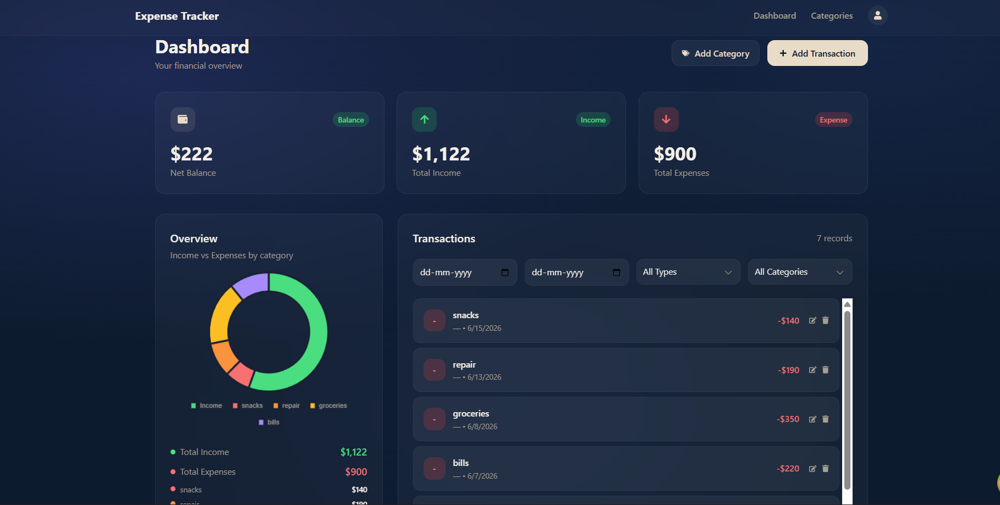
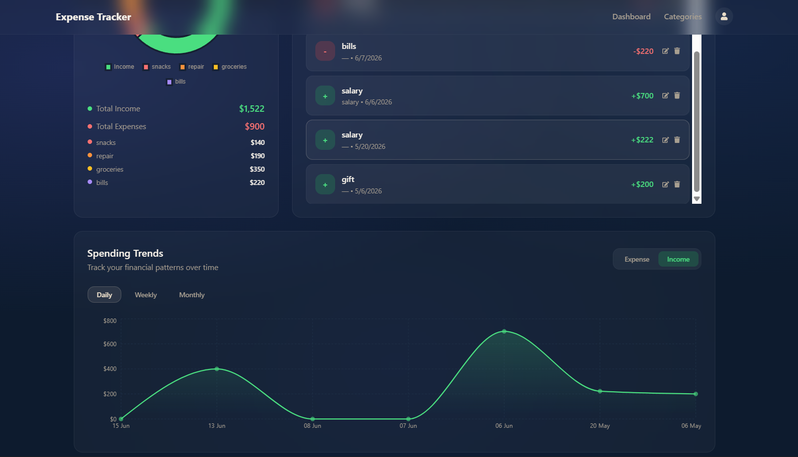
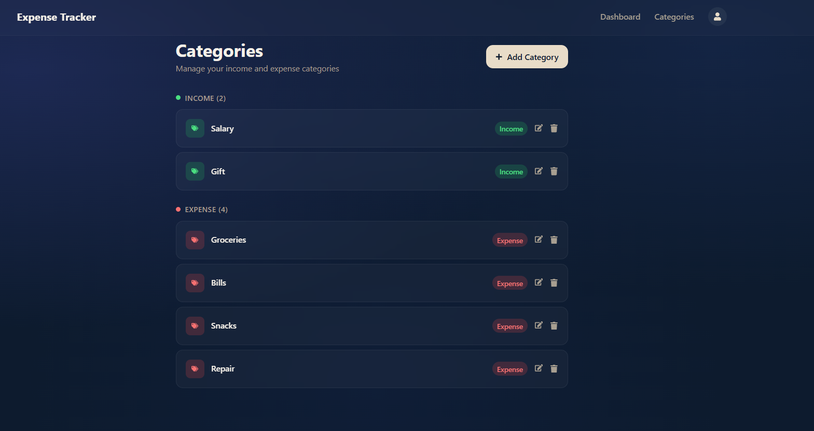

<div align="center">

# Expense Tracker

### A full-stack personal finance management application built with the MERN stack

Track income and expenses, manage custom categories, and visualise spending patterns through interactive charts and trend analysis — built with a dark glassmorphism UI.

[](https://mongodb.com)
[](https://expressjs.com)
[](https://reactjs.org)
[](https://nodejs.org)
[](https://tailwindcss.com)

**[Live Demo](https://etracker-lemon.vercel.app)**

</div>

---

## Web Interface Showcase

### Dashboard — Financial Overview


### Spending Trends — Area Chart Analysis


### Categories — Income & Expense Management


---

## Features

- **JWT Authentication** — Secure login and registration with token-based auth and bcryptjs password hashing
- **Income & Expense Tracking** — Log transactions with amount, date, category, and description
- **Custom Categories** — Create, edit, and delete income/expense categories inline
- **Smart Filtering** — Filter transactions by date range, type, and category
- **Interactive Doughnut Chart** — Visual breakdown of income vs expenses per category
- **Spending Trends** — Area chart showing daily, weekly, and monthly patterns with income/expense toggle
- **Profile Management** — Update username, email, and password
- **Glassmorphism UI** — Dark navy theme with frosted glass card design

---

## Tech Stack

| Layer | Technologies |
|---|---|
| **Frontend** | React, Vite, Redux Toolkit, TanStack Query, Tailwind CSS |
| **Charts** | Chart.js, Recharts |
| **Forms** | Formik, Yup |
| **Backend** | Node.js, Express.js |
| **Database** | MongoDB, Mongoose |
| **Auth** | JWT, bcryptjs |
| **HTTP** | Axios |

---

## Getting Started

### Prerequisites

- Node.js v18+
- MongoDB Atlas account

### 1. Clone the repository

```bash
git clone https://github.com/sun0028/Etracker.git
cd Etracker
```

### 2. Backend setup

```bash
cd backend
npm install
```

Create a `.env` file inside `backend/`:

```env
MONGO_URL=mongodb+srv://<username>:<password>@cluster.mongodb.net/etracker
JWT_SECRET=your_secret_key_here
PORT=8000
```

Start the backend:

```bash
npm run dev
```

### 3. Frontend setup

```bash
cd frontend
npm install
npm run dev
```

App runs at `http://localhost:5173`

---


## Project Structure

```
Etracker/
├── backend/
│   ├── controllers/
│   │   ├── categoryCtrl.js
│   │   ├── transactionCtrl.js
│   │   └── usersCtrl.js
│   ├── middlewares/
│   │   ├── errorHandlerMiddleware.js
│   │   └── isAuth.js
│   ├── model/
│   │   ├── Category.js
│   │   ├── Transaction.js
│   │   └── User.js
│   ├── routes/
│   │   ├── categoryRouter.js
│   │   ├── transactionRouter.js
│   │   └── userRouter.js
│   └── app.js
└── frontend/
    └── src/
        ├── components/
        │   ├── Auth/
        │   ├── Category/
        │   ├── Home/
        │   ├── Navbar/
        │   ├── Transactions/
        │   └── Users/
        ├── redux/
        │   └── slice/authSlice.js
        ├── services/
        │   ├── category/categoryService.js
        │   ├── transactions/transactionService.js
        │   └── users/userService.js
        └── utils/
```


---

## API Reference

### Auth Routes

| Method | Endpoint | Auth Required | Description |
|---|---|---|---|
| POST | `/api/v1/users/register` | No | Register new user |
| POST | `/api/v1/users/login` | No | Login, returns JWT |
| GET | `/api/v1/users/profile` | Yes | Get user profile |
| PUT | `/api/v1/users/update-profile` | Yes | Update username/email |
| PUT | `/api/v1/users/change-passwords` | Yes | Change password |

### Category Routes

| Method | Endpoint | Auth Required | Description |
|---|---|---|---|
| POST | `/api/v1/categories/create` | Yes | Create category |
| GET | `/api/v1/categories/lists` | Yes | List all categories |
| PUT | `/api/v1/categories/update/:id` | Yes | Update category |
| DELETE | `/api/v1/categories/delete/:id` | Yes | Delete category |

### Transaction Routes

| Method | Endpoint | Auth Required | Description |
|---|---|---|---|
| POST | `/api/v1/transactions/create` | Yes | Add transaction |
| GET | `/api/v1/transactions/lists` | Yes | Get filtered transactions |
| PUT | `/api/v1/transactions/update/:id` | Yes | Update transaction |
| DELETE | `/api/v1/transactions/delete/:id` | Yes | Delete transaction |

---

## Deployment

### Backend — [Render](https://render.com)

1. Create a new Web Service and connect your GitHub repository
2. Set root directory to `backend`
3. Build command: `npm install`
4. Start command: `node app.js`
5. Add environment variables: `MONGO_URL`, `JWT_SECRET`, `PORT`

### Frontend — [Vercel](https://vercel.com)

1. Import your GitHub repository
2. Set root directory to `frontend`
3. Add environment variable: `VITE_API_URL=https://your-backend.onrender.com/api/v1`
4. Deploy

---

## Environment Variables

| Variable | Location | Description |
|---|---|---|
| `MONGO_URL` | `backend/.env` | MongoDB Atlas connection string |
| `JWT_SECRET` | `backend/.env` | Secret key for JWT signing |
| `PORT` | `backend/.env` | Server port (default: 8000) |
| `VITE_API_URL` | `frontend/.env` | Backend API base URL (include `/api/v1`) |

---

## Author

**Sonali Saini**

[](https://github.com/sun0028)